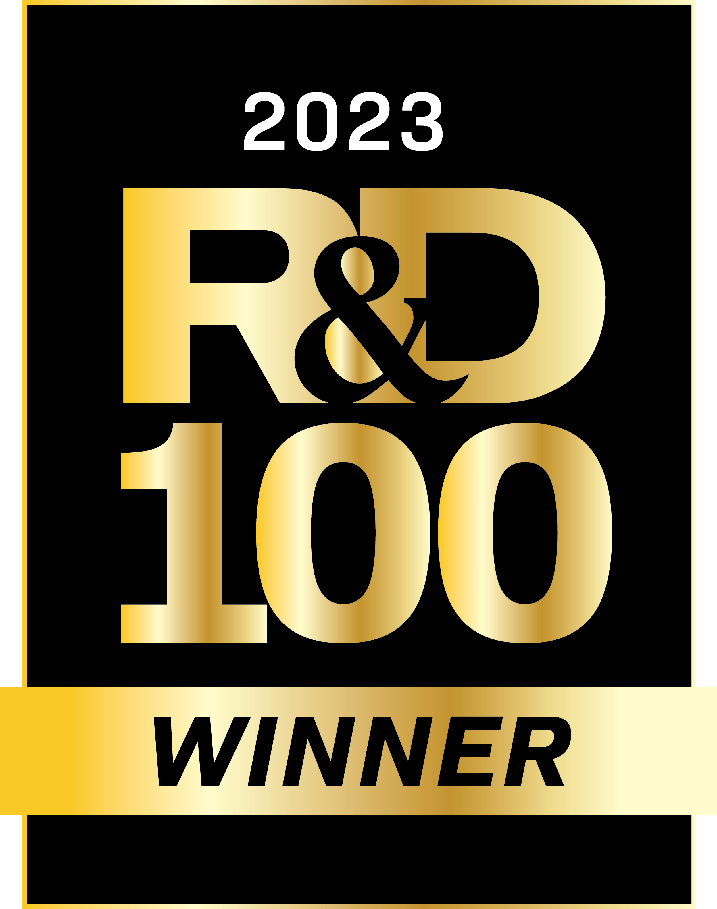
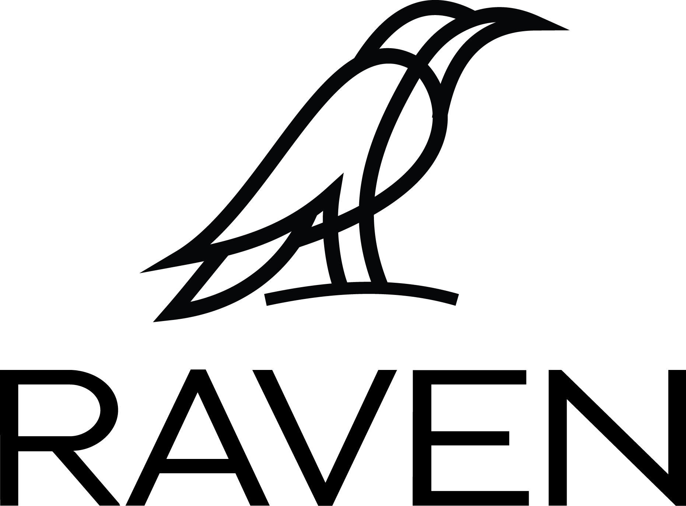

# Risk Analysis Virtual Environment ([RAVEN](https://inl.gov/raven/))

[RAVEN](https://inl.gov/raven/) is designed to perform parametric and probabilistic analysis based on the response of complex system codes. RAVEN is capable of investigating the system response as well as the input space using Monte Carlo, Grid, or Latin Hyper Cube sampling schemes, but its strength is focused toward system feature discovery, such as limit surfaces, separating regions of the input space leading to system failure, using dynamic supervised learning techniques. RAVEN includes the following major capabilities:

- Sampling of codes for uncertainty quantification and reliability analyses
- Generation and use of reduced-order models (also known as surrogate)
- Data post-processing (time dependent and steady state)
- Time dependent and steady state, statistical estimation and sensitivity analysis (mean, variance, sensitivity coefficients, etc.).

The RAVEN statistical analysis framework can be employed for several types of applications:

- Uncertainty Quantification
- Sensitivity Analysis / Regression Analysis
- Probabilistic Risk and Reliability Analysis (PRA)
- Data Mining Analysis
- Model Optimization

RAVEN provides a set of basic and advanced capabilities that ranges from data generation, data processing and data visualization. More information can be found at [RAVEN Wiki](https://github.com/idaholab/raven/wiki).

## Computing environment

- Parallel computation capabilities (multi-thread and multi-core)
- Supported operating systems: MAC, Linux and Windows
- Workstation and high performance computing (HPC) systems

## Forward propagation of uncertainties

- MonteCarlo sampling
- Grid sampling
- Stratified Sampling
- Factorial design
- Response surface design
- Generalized Polynomial Chaos (gPC) with sparse grid collocation (SGC)
- Generalized Polynomial Chaos (gPC) with sparse grid collocation (SGC) using the High Dimensional Model Representation expansion (HDMR)

- General combination of the above sampling strategies

## Advance sampling methods

- Moment driven adaptive gPC using SGC
- Sobol index driven HDMR integrated using SGC over gPC basis
- Adaptive sampling for limit surface finding (surrogate and multi grid based accelerations)
- Dynamic event tree-based sampling (Dynamic Event Trees, Hybrid Dynamic Event Trees, Adaptive Dynamic Event Trees, Adaptive Hybrid Dynamic Event Trees)

## Creation and use of reduced order models

- Support Vector Machine-based surrogates
- Gaussian process models
- Linear models
- Multi-class classifiers
- Decision trees
- Naive Bayes
- Neighbors classifiers and regressors
- Multi-dimensional interpolators
- High dimension model reduction (HDMR)
- Morse-Smale complex

## Model capabilities

- Generic interface with external codes
- Custom code interfaces (third-party software(s) currently available:
    - [RELAP5-3D](https://relap53d.inl.gov/SitePages/Home.aspx)
    - [GOTHIC](http://www.numerical.com/products/gothic/gothic_all.php)
    - [MELCOR](https://melcor.sandia.gov/about.html)
    - [MAAP5](https://www.fauske.com/nuclear/maap-modular-accident-analysis-program)
    - [MOOSE-BASED Apps](https://mooseframework.inl.gov/)
    - [BISON](https://bison.inl.gov/SitePages/Home.aspx)
    - [SCALE](https://www.ornl.gov/onramp/scale-code-system)
    - [SERPENT](http://montecarlo.vtt.fi/)
    - [COBRA TF](https://www.ne.ncsu.edu/rdfmg/cobra-tf/)
    - [Open FOAM](https://www.openfoam.com)
    - [SAPHIRE](https://saphire.inl.gov/)
    - [MODELICA](https://www.modelica.org/modelicalanguage)
    - [DYMOLA](https://www.3ds.com/products-services/catia/products/dymola/)
    - [SIMULATE](https://www.studsvik.com/key-offerings/nuclear-simulation-software/software-products/simulate5/)
    - [PARCS](https://www.nrc.gov/docs/ml1016/ml101610098.pdf)
    - [Prescient](https://github.com/grid-parity-exchange/Prescient)
    - [HTPIPE](https://www.osti.gov/biblio/6726117)
    - [NEUTRINO](http://www.neutrinodynamics.com/)
    - [RAVEN running itself](https://raven.inl.gov/SitePages/Overview.aspx)

    <!-- - [RATTLESNAKE](https://rattlesnake.inl.gov/SitePages/Home.aspx)
    - [MAMMOTH](https://moose.inl.gov/mammoth/SitePages/Home.aspx)
    - [PHISICS](https://modsimcode.inl.gov/SitePages/Home.aspx) -->

- Custom ad-hoc external models (build in python internally to RAVEN)

## Data Post-Processing capabilities

- Data clustering
- Data regression
- Data dimensionality Reduction
- Custom generic post-processors
- Time-dependent data analysis
  - Statistics, sensitivity and uncertainty analysis
  - Clustering/classification
  - Time series analysis, such as ARMA, AutoARMA, MarkovAR, RWD, STL, Wavelet, VARMA, and Fourier.
- Data plotting

## Model parameter optimization

- Gradient-based approach
- Simultaneous perturbation stochastic approximation method
- Bayesian optimization
- Genetic algorithms including single and multi-objective optimization

## Data management

- Data importing and exporting
- Databases creation

More information on this project is available at the [RAVEN website](https://raven.inl.gov/SitePages/Overview.aspx).

This project is supported by [Idaho National Laboratory](https://www.inl.gov/).

## Official Plugins
The following plugin repositories are officially supported by RAVEN.
### Openly Available
These plugin repositories are available without restriction to RAVEN users:
 - [`TEAL`](https://github.com/idaholab/TEAL) module: provides economic analysis.
 - [`HERON`](https://www.github.com/idaholab/HERON) module: provides workflow generation and dispatching models for performing stochastic technoeconomic analysis of systems of components interconnected by the resources they produce and consume.
 - [`SR2ML`](https://github.com/idaholab/SR2ML) module: provides safety, risk and reliability analysis tools.
 - [`LOGOS`](https://github.com/idaholab/LOGOS) module: provides computational capabilities to optimize plant resources such as maintenance optimization and optimal component replacement schedule by using state-of-the-art discrete optimization methods.
 - [`FARM`](https://github.com/Argonne-National-Laboratory/FARM) module: is designed to solve the supervisory control problem in Integrated Energy System (IES) project. FARM utilizes the linear state-space representation (A,B,C matrices) of a model to predict the system state and output in the future time steps, and adjust the actuation variable to avoid the violation of implicit thermal mechanical constraints.
 - [`BayCal`](https://github.com/idaholab/BayCal) module: is aiming at inversely quantifying the uncertainties associated with simulation model parameters based on available experiment data. BayCal tries to resolve two critical issues existing in the Bayesian inference: 1) high-dimensional experimental data (such as time series observations at multiple locations), 2) expensive computational simulations. These issues have been studied and resolved in literature, but there is not yet a complete toolkit to resolve these issues in an efficient and automatic way. BayCal automatizes the process by coupling with RAVEN, utilizes artificial intelligence algorithms to automatically construct surrogate models for the expensive computational simulations and dimensionality reduction techniques to significantly reduce the number of simulations for convergence.
 - [`POEM`](https://idaholab.github.io/POEM/): is a platform for optimal experiment management, powered with automated machine learning to accelerate the discovery of optimal solutions, and automatically guide the design of experiments to be evaluated. POEM currently supports 1) random model explorations for experiment design, 2) sparse grid model explorations with Gaussian Polynomial Chaos surrogate model to accelerate experiment design ,3) time-dependent model sensitivity and uncertainty analysis to identify the importance features for experiment design, 4) model calibrations via Bayesian inference to integrate experiments to improve model performance, and 5) Bayesian optimization for optimal experimental design. In addition, POEM aims to simplify the process of experimental design for users, enabling them to analyze the data with minimal human intervention, and improving the technological output from research activities. POEM leverages RAVEN (a robust platform to support model explorations and decision making) to allow for large scalability and reduction of the computational costs and provides access to complex physical models while performing optimal experimental design.

### Other Software
[Idaho National Laboratory](https://www.inl.gov/) is a cutting edge research facility which is a constantly producing high quality research and software. Feel free to take a look at our other software and scientific offerings at:

[Primary Technology Offerings Page](https://www.inl.gov/inl-initiatives/technology-deployment)

[Supported Open Source Software](https://github.com/idaholab)

[Raw Experiment Open Source Software](https://github.com/IdahoLabResearch)

[Unsupported Open Source Software](https://github.com/IdahoLabCuttingBoard)

### License

Files in crow/contrib, src/contrib and framework/contrib are third party libraries that are not part of Raven and are provided here for covenience. These are under their own, seperate licensing which is described in those directories.

Raven itself is licensed as follows:

Copyright 2016 Battelle Energy Alliance, LLC

Licensed under the Apache License, Version 2.0 (the "License");
you may not use this file except in compliance with the License.
You may obtain a copy of the License at

  http://www.apache.org/licenses/LICENSE-2.0

Unless required by applicable law or agreed to in writing, software
distributed under the License is distributed on an "AS IS" BASIS,
WITHOUT WARRANTIES OR CONDITIONS OF ANY KIND, either express or implied.
See the License for the specific language governing permissions and
limitations under the License.
