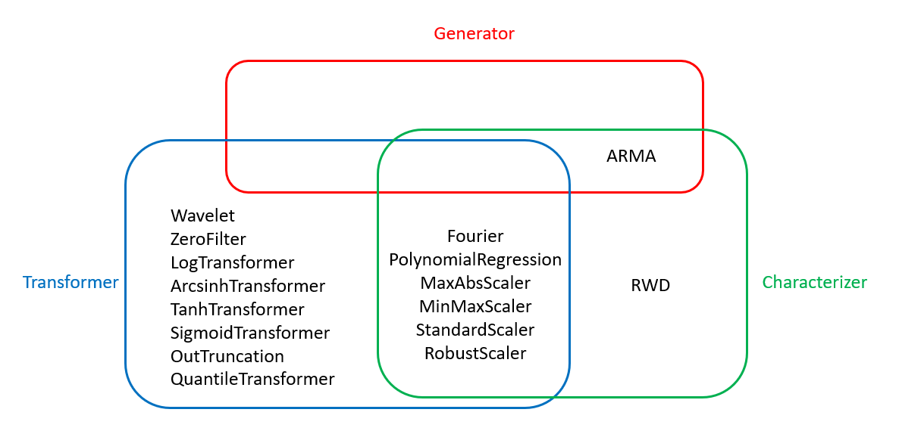

# TSA Module
The TSA module houses algorithms which are helpful for characterizing and generating time series signals.
It is designed to be modular to allow users to mix and match algorithms to best suit their data and goals.

## Base Classes
Three base classes define the interface and capabilities of each TSA algorithm: `TimeSeriesCharacterizer`, `TimeSeriesGenerator`, and `TimeSeriesTransformer`.
Each of these in turn extends the `TimeSeriesAnalyzer` class.
The following subsections briefly describe the functionality contributed by each base class.
The purpose of this document is to explain the structure of this module and the various base classes used to construct time series algorithms to give guidance to future users and developers on which base classes are appropriate for new TSA algorithms.
Algorithm-specific documentation and examples are provided in the RAVEN User Manual.

### TimeSeriesAnalyzer
Provides an interface common to all TSA module algorithms.
This class serves exclusively as a base class for the `TimeSeriesCharacterizer`, `TimeSeriesGenerator`, and `TimeSeriesTransformer` classes.
This class should never be directly instatiated or used as a base class for a new algorithm!

### TimeSeriesCharacterizer
Algorithms which inherit from `TimeSeriesCharacterizer` seek to characterize a time series signal by fitting some number of parameters to the data.
The characteristic parameters are listed in the `_features` class attribute.
Note that while a model may need to be fit to the data, the resulting model parameters may not be useful for characterization!
Only inherit from this class if the model parameters are useful for characterization tasks.

### TimeSeriesGenerator
Algorithms which stochastically generate a signal are `TimeSeriesGenerator` instances.
Note that this class is reserved exclusively for stochastic generators.
Deterministic algorithms are better implemented as a `TimeSeriesTransformer` subclass.

### TimeSeriesTransformer
Transformers, as their name implies, apply a transformation to the input data.
Specifically, the purpose of these transformers is not to generate or to characterize, but to simply modify the data in some way.
The `TimeSeriesTransformer` class is also responsible for computing model residuals during the fitting process and combining one or more signals into a single signal during the generation process.

## TSA Algorithm Inheritance
The following diagram shows which base classes each currently implemented TSA algorithm inherits from.

